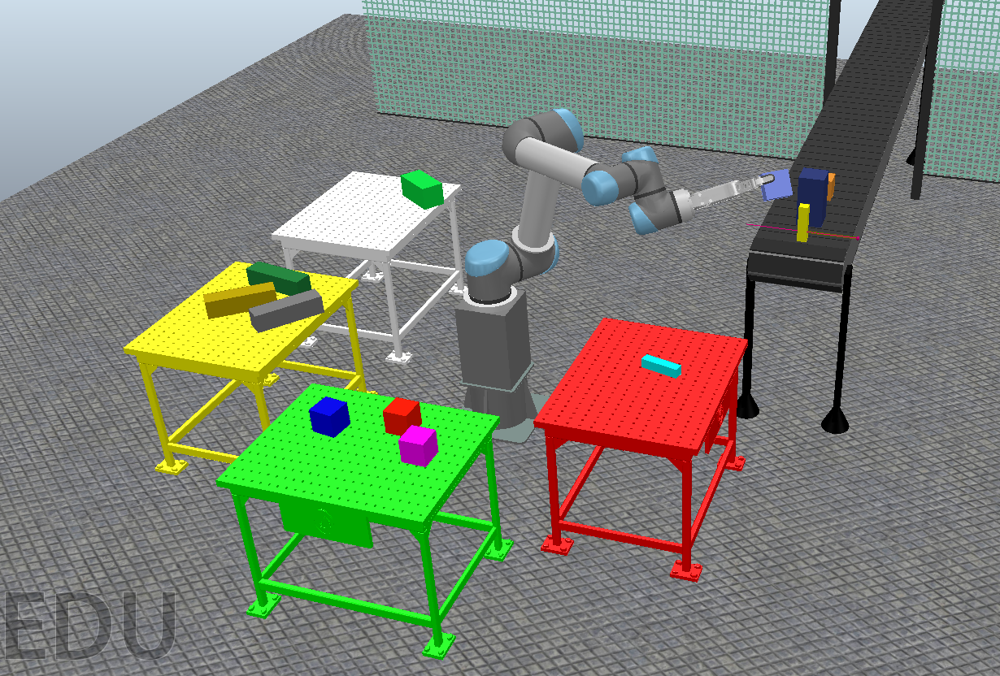

# APO-MORL: Adaptive Pareto-Optimal Multi-Objective Reinforcement Learning for UR5 Manufacturing

[](https://doi.org/10.6084/m9.figshare.30017611)
[](https://opensource.org/licenses/MIT)

## Overview

This repository contains the complete implementation of the Adaptive Pareto-Optimal Multi-Objective Reinforcement Learning (APO-MORL) framework for robotic pick-and-place manufacturing systems using the UR5 robot in CoppeliaSim EDU.

## System Architecture


*Figure 1: UR5 robotic manufacturing system with multi-station pick-and-place configuration*

## Video Demonstration

[System Operation Video](videos/System_Overview.avi) - Complete demonstration of the UR5 manufacturing system in CoppeliaSim EDU showing multi-objective optimization in action.

## Key Features

- **Multi-Objective Optimization**: Simultaneous optimization of 6 manufacturing objectives
- **Real-time Adaptation**: Dynamic response to changing manufacturing conditions
- **Comprehensive Evaluation**: Statistical validation against 7 baseline algorithms
- **Publication-Quality Results**: Complete experimental validation with statistical analysis

## Manufacturing Objectives

1. **Throughput** - Parts processed per minute
2. **Cycle Time** - Time per complete manufacturing cycle  
3. **Energy Efficiency** - Power consumption optimization
4. **Precision** - Placement accuracy and repeatability
5. **Wear Reduction** - Joint stress and maintenance minimization
6. **Collision Avoidance** - Safety margin maintenance

## Repository Structure

```
├── src/                          # Source code
│   ├── test_morl_system.py      # System validation and testing
│   ├── ur5_morl_production.py   # Main MORL implementation
│   ├── generate_individual_plots.py # Publication plots generator
│   └── environment_interface.py  # CoppeliaSim integration
├── figures/                      # Generated publication figures
│   ├── Figure_1_System_Overview.png
│   ├── Figure_2_Performance_Comparison.*
│   ├── Figure_3_Effect_Sizes.*
│   └── ... (8 figures total, PNG/PDF/TIFF formats)
├── videos/                       # Video documentation
│   └── System_Overview.avi     # Complete system demonstration
├── results/                      # Experimental results
│   ├── complete_validation_results.json
│   ├── performance_comparison_table.csv
│   └── statistical_significance_table.csv  
├── docs/                         # Documentation
│   ├── INSTALLATION.md
│   └── USAGE.md
└── LICENSE                       # MIT License
```

## Quick Start

### Prerequisites

```bash
pip install numpy matplotlib pandas scipy scikit-learn seaborn gymnasium
pip install coppeliasim-zmqremoteapi-client  # For CoppeliaSim integration
```

### Running the Complete Validation

```bash
# 1. Validate system readiness
python src/test_morl_system.py

# 2. Run complete experimental validation  
python src/ur5_morl_production.py

# 3. Generate publication-quality figures
python src/generate_individual_plots.py
```

### CoppeliaSim Integration (Optional)

1. Open CoppeliaSim EDU
2. Load the scene: `ur5WithRg2Grasping-python_30.08.2025.ttt`
3. Start simulation
4. Run: `python src/environment_interface.py`

## Results Summary

The APO-MORL algorithm demonstrates significant improvements over baseline methods:

- **+34.6%** improvement vs Single-Objective PPO (p < 0.001)
- **+22.9%** improvement vs Traditional Control (p < 0.001)
- **+21.4%** improvement vs MOEA-D (p < 0.01)
- **Statistical significance**: 5/7 comparisons (p < 0.05)
- **Effect sizes**: Large effects (Cohen's d > 0.8) for most comparisons

## Generated Figures

All figures are available in PNG (600 DPI), PDF, and TIFF formats:

1. **Figure 1**: System Overview (CoppeliaSim scene)
2. **Figure 2**: Algorithm Performance Comparison
3. **Figure 3**: Effect Sizes vs Baseline Algorithms  
4. **Figure 3.bis**: Statistical Significance Analysis
5. **Figure 4**: Training Convergence Analysis
6. **Figure 5**: Pareto Front Evolution
7. **Figure 6**: Individual Objective Learning Curves
8. **Figure 7**: 2D Pareto Front Visualization
9. **Figure 8**: Detailed Convergence Analysis

## Data Availability

Experimental data supporting these results is available on FigShare:
**DOI**: [10.6084/m9.figshare.30017611](https://doi.org/10.6084/m9.figshare.30017611)

The dataset includes:
- Raw performance measurements for all algorithms
- Training progression data
- Statistical analysis results
- Complete experimental configuration

## Citation

If you use this code or data in your research, please cite:

```bibtex
@article{urrea2024apomorl,
  title={APO-MORL: An Adaptive Pareto-Optimal Framework for Real-Time Multi-Objective Optimization in Robotic Pick-and-Place Manufacturing Systems},
  author={Urrea, Claudio},
  journal={[Journal Name]},
  year={2024},
  publisher={[Publisher]},
  doi={[DOI when published]}
}
```

## License

This project is licensed under the MIT License - see the [LICENSE](LICENSE) file for details.

## Contact

Claudio Urrea - Universidad de Santiago de Chile  
Department of Electrical Engineering  
- Email: [claudio.urrea@usach.cl]
- ORCID: [https://orcid.org/0000-0001-7197-8928]

## Acknowledgments

- This research was conducted using CoppeliaSim EDU for educational and research purposes
- Video documentation demonstrates complete system operation
- Statistical analysis validates algorithm performance across multiple manufacturing objectives